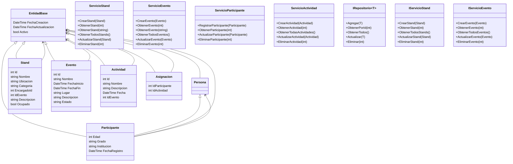

# Diagrama de Clases - EduFairOS

```mermaid
classDiagram
    EntidadBase <|-- Persona
    EntidadBase <|-- Stand
    EntidadBase <|-- Evento
    EntidadBase <|-- Actividad
    EntidadBase <|-- Participante
    EntidadBase <|-- Asignacion

    Persona <|-- Participante

    Stand : int Id
    Stand : string Nombre
    Stand : string Ubicacion
    Stand : string Categoria
    Stand : int EncargadoId
    Stand : int IdEvento
    Stand : string Descripcion
    Stand : bool Ocupado

    Evento : int Id
    Evento : string Nombre
    Evento : DateTime FechaInicio
    Evento : DateTime FechaFin
    Evento : string Lugar
    Evento : string Descripcion
    Evento : string Estado

    Actividad : int Id
    Actividad : string Nombre
    Actividad : string Descripcion
    Actividad : DateTime Fecha
    Actividad : int IdEvento

    Participante : int Edad
    Participante : string Grado
    Participante : string Institucion
    Participante : DateTime FechaRegistro

    Asignacion : int IdParticipante
    Asignacion : int IdActividad

    EntidadBase : DateTime FechaCreacion
    EntidadBase : DateTime FechaActualizacion
    EntidadBase : bool Activo

    class ServicioStand {
        +CrearStand(Stand)
        +ObtenerStand(int)
        +ObtenerStand(string)
        +ObtenerTodosStands()
        +ActualizarStand(Stand)
        +EliminarStand(int)
    }

    class ServicioEvento {
        +CrearEvento(Evento)
        +ObtenerEvento(int)
        +ObtenerEvento(string)
        +ObtenerTodosEventos()
        +ActualizarEvento(Evento)
        +EliminarEvento(int)
    }

    class ServicioParticipante {
        +RegistrarParticipante(Participante)
        +ObtenerParticipante(int)
        +ActualizarParticipante(Participante)
        +EliminarParticipante(int)
    }

    class ServicioActividad {
        +CrearActividad(Actividad)
        +ObtenerActividad(int)
        +ObtenerTodasActividades()
        +ActualizarActividad(Actividad)
        +EliminarActividad(int)
    }

    class IRepositorio~T~ {
        +Agregar(T)
        +ObtenerPorId(int)
        +ObtenerTodos()
        +Actualizar(T)
        +Eliminar(int)
    }

    class IServicioStand {
        +CrearStand(Stand)
        +ObtenerStand(int)
        +ObtenerTodosStands()
        +ActualizarStand(Stand)
        +EliminarStand(int)
    }

    class IServicioEvento {
        +CrearEvento(Evento)
        +ObtenerEvento(int)
        +ObtenerTodosEventos()
        +ActualizarEvento(Evento)
        +EliminarEvento(int)
    }

    EntidadBase <-- Stand
    EntidadBase <-- Evento
    EntidadBase <-- Actividad
    EntidadBase <-- Participante
    EntidadBase <-- Asignacion
    Persona <-- Participante
```
